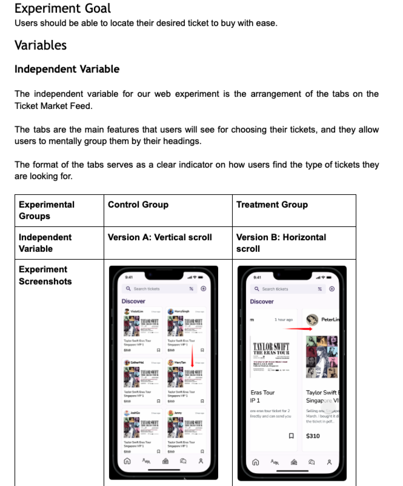

# ConcertKaki
A concert buddy matching platform for solo concert-goers.

# Problem Statement

Concertgoers often struggle to find companions to attend concerts with, while existing resale platforms lack trust, verification, and concert-specific features, leading to fragmented and risky user experiences.

---

# Product Strategy

ConcertKaki combines social matching and verified ticket resale into a single ecosystem, reducing emotional friction for solo concertgoers while creating a safer and more efficient concert ticket marketplace.

---
# Key Features

- Swipe-based concert buddy matching
- Undo Swiping Function
- Intention Checker
- Onboarding Tutorial
- Ticket/Seller Verification mechanism
  
---

# Navigation Flow

## Product Screens

### 1. Welcome & Login

---

### 2. 

Sign Up

---

### 3. 

Home Page

---

### 4. Kaki Finder Flow

  #### Onboarding
  
  
  #### Filter
  
  
  #### Matched State
  

---

### 5 Ticket Marketplace

  #### Marketplace Overview
  

---

### 6 Chat

---

### 7 Profile Page

---

## A/B Testing

--

# Scenario Video

# Pitch Video

# Maze Video

---

